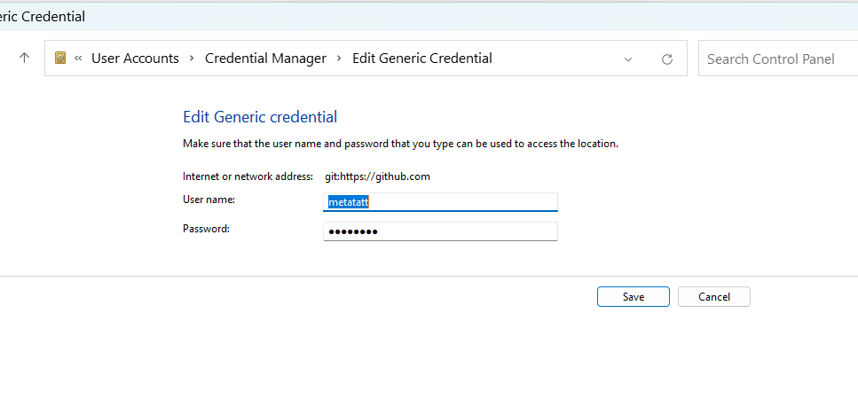

# Pilot - Training Videos

This is a simple Node.js application for serving training videos. The app uses Express.js and various other dependencies for handling file uploads, sessions, and sending emails.


## git switch
`git config user.name "simonisHereHelp"
git config user.email "your-repo-specific-email@example.com"
`
simonisHereHelp vs metatatt
Control Panel\User Accounts\Credential Manager\Edit Generic Credential


## Project Structure

```
my-node-app/
│
├── index.js
├── package.json
├── public/
│   └── main.js
└── vercel.json
```

## Getting Started

### Prerequisites

Make sure you have the following installed on your machine:

- [Node.js](https://nodejs.org/) (LTS version recommended)
- npm (comes with Node.js)
- [Vercel CLI](https://vercel.com/download)

### Installation

1. **Clone the repository:**

   ```bash
   git clone https://github.com/your-username/my-node-app.git
   cd my-node-app
   ```

2. **Install dependencies:**

   ```bash
   npm install
   ```

3. **Create a `.env` file in the root directory:**

   ```plaintext
   EMAIL_USER=your-email@example.com
   EMAIL_PASS=your-email-password
   ```

### Running the Application Locally

To start the application locally, use the following command:

```bash
npm run dev
```

This will start the server using `nodemon`, which will automatically restart the server when changes are detected.

### Deploying to Vercel

1. **Login to Vercel:**

   If you haven't logged in to Vercel yet, run:

   ```bash
   vercel login
   ```

2. **Deploy the application:**

   To deploy your application to Vercel, run:

   ```bash
   npm run deploy
   ```

   This command will deploy your application in production mode.

## Scripts

- **`start`**: Starts the application using Node.js.
- **`dev`**: Starts the application in development mode using `nodemon`.
- **`deploy`**: Deploys the application to Vercel in production mode.

## Environment Variables

Ensure you have the following environment variables set in your `.env` file:

```plaintext
EMAIL_USER=your-email@example.com
EMAIL_PASS=your-email-password
```

## Dependencies

- `express`: Fast, unopinionated, minimalist web framework for Node.js
- `body-parser`: Node.js body parsing middleware
- `dotenv`: Loads environment variables from a .env file into `process.env`
- `express-session`: Simple session middleware for Express
- `multer`: Middleware for handling `multipart/form-data`, which is primarily used for uploading files
- `nodemailer`: Easy as cake email sending from your Node.js applications
- `nodemon`: Tool that helps develop Node.js applications by automatically restarting the node application when file changes in the directory are detected

## License

This project is licensed under the ISC License.
